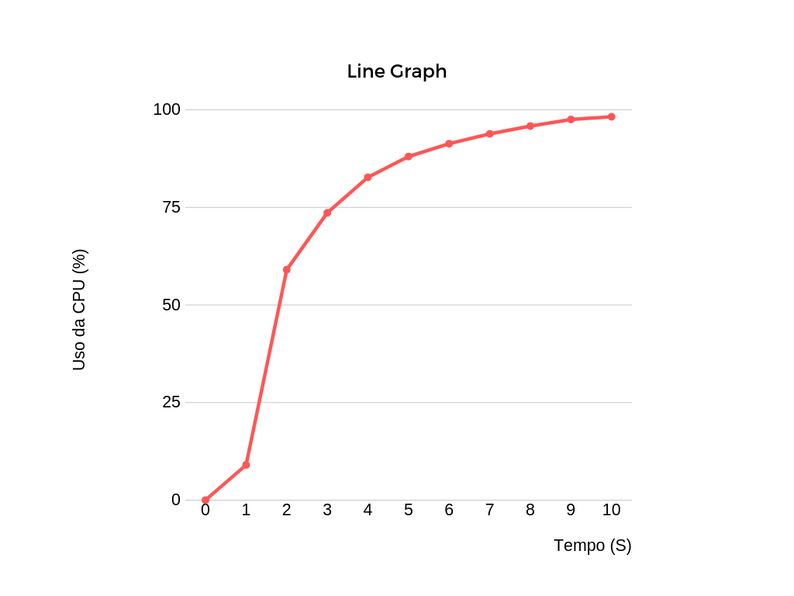
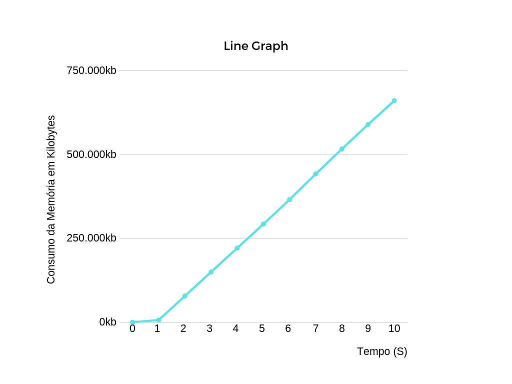

# Identificação

* Página do repositório do trabalho ([link GitHub](https://github.com/rafaemilima/AB2_INCP)) 

* Discente 1
	* Nome: João Vitor Santos Tavares
	* Matrícula: 19111157 
	* Distribuição da nota (%): 30
* Discente 2
	* Nome: Rafael Emilio Lima Alves
	* Matrícula: 19111329
	* Distribuição da nota (%): 40
* Discente 3
	* Nome: Wagner Anthony de Medeiros Silva
	* Matrícula: 19111335
	* Distribuição da nota (%): 30

# Discussão 

* O programa funciona da seguinte forma:
	Inicialmente cria-se um processo secundário através do uso da função fork(), esse processo é hierarquicamente o processo filho, porém o mesmo só será criado dependendo do retorno da função fork(). Caso o retorno seja menor do que zero ocorreu um erro ao gerar o processo filho, o programa então notifica o erro e encerra a execução com o valor -1. O retorno também pode ser maior ou igual a zero, caso seja igual indica que o processo em execução é o processo original, o processo pai, e caso seja maior que zero o processo em questão é o filho gerado. 
	Depois disso, o processo filho tem seu id convertido e salvo em uma string, para ser possivel a cocatenação com os comandos que serão usados no terminal de dentro do execultável.
	Esses dois argumentos são o "cpu" e o "cpu_mem", e é a partir deles que os resultados serão expostos. 

## Utilização intensa da UCP

* Quando o argumento "cpu" é chamado, um loop infinito é iniciado no processo filho através de um "while". E é a partir desse loop que a cpu começará a ser usada, e tal uso funciona, como fica demonstrado na aba de resultados, pois ele ascende de 0% a 98,2%.

## Utilização intensa da UCP e memória

* Ao executar o programa com o argumento "cpu_mem" inciasse um loop infinito usando "while", como falado no tópico anterior, é através desse loop que o uso da cpu ascende e, sendo assim, pode ser monitorado. Além disso, é dentro desse loop que a função malloc irá atuar repetidamente. A função em questão é responsável por alocar memória, nesse caso 1 byte, e a partir de então o uso da memória principal vai se elevando gradativamente. A medida que o tempo passa, a alocação vai sendo incrementada, podendo chegar a um ponto em que o computador apresentará mal funcionamento, já que a memória estará totalmente ocupada. 

# Resultados
	
* Os gráficos abaixo configuram as amostras que obtivemos durante a execução do nosso programa.

	

	* O gráfico acima é referente ao uso da cpu, a linha de crescimento começou em 0% e atingiu ao final de dez segundos 98,2%. Um dado importante a ser observado é a rápida ascenção, entre o intervalo de um e dois segundos, nos quais a taxa subiu de 8.6% a 59%. Após isso o crescimento do uso da cpu continua, contudo de forma menos brusca.  

	
	
	* Diferente do anterior, o gráfico acima se refere a alocação de memória, onde os dados são apresentados em Kilobytes em função do tempo. No intervalo de tempo representado (dez segundos), o pico é de 658.888 kb, e o crescimento se apresenta de forma praticamente uniforme. Considerações importantes a serem tomadas é o quanto de memória foi tomada em tão pouco tempo, e isso se deve ao argumento passado para a função malloc (responsável pela alocação de memória), que no caso foi 1 byte.

	
	
	* Assim como o gráfico prévio, esse também é referente ao uso da memória, contudo agora os dados estão apresentados em porcentagem de uso em função do tempo. Ao comparar o gráfico com o seu prescedente é possível visualizar melhor o que foi explicado anteriormente com relação ao rápido crescimento na alocação de memória, já que o dado percentual é uma abstração mais intuitiva. Sendo assim, nota-se que em 10 segundos a memória uso subiu de 0% para 8,9%, sendo assim é possível inferir que seria inviável continuar a execução desse programa por muito tempo, já que em apenas dez segundos pouco menos de 10% da memoria já havia sido ocupada.
